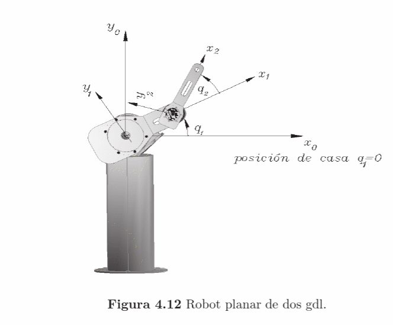
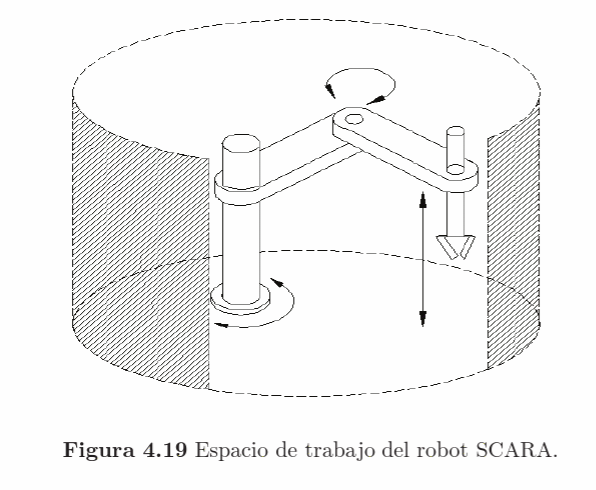
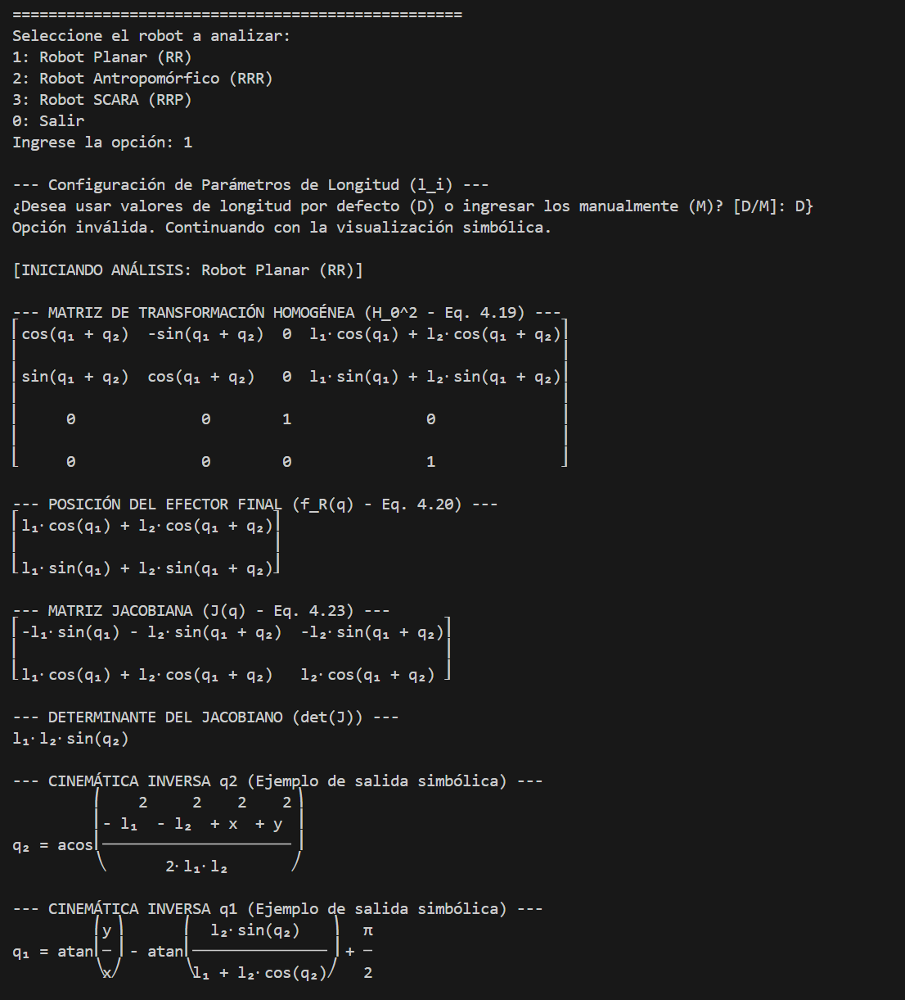
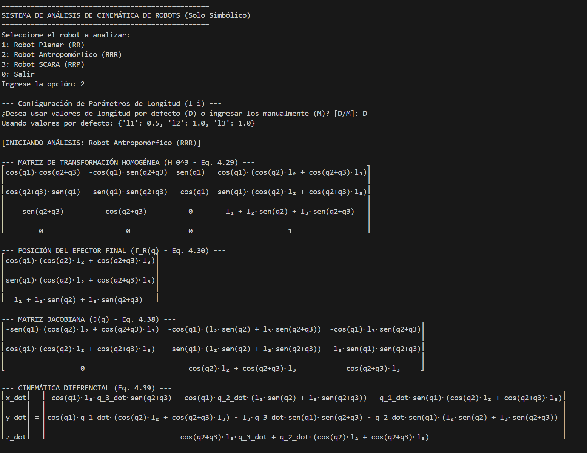
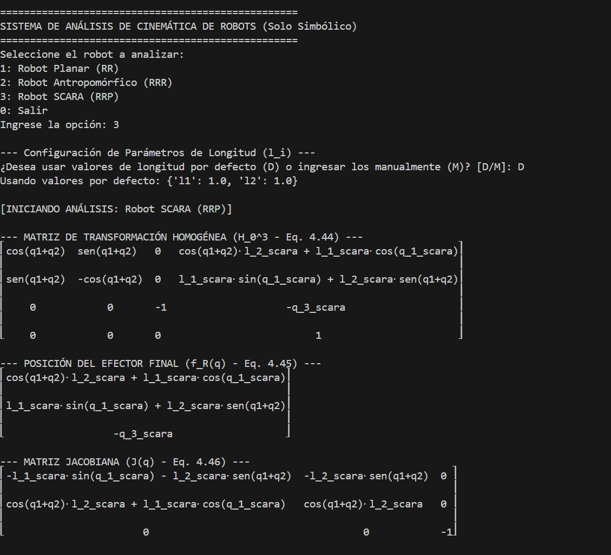

# 🤖 Implementación de Cinemática Directa Simbólica (DH)
## Control de Robots Manipuladores - [TU NOMBRE COMPLETO]
## 1. Introducción

Este proyecto tiene como objetivo implementar y verificar la **cinemática directa (Forward Kinematics)** para tres configuraciones de robots manipuladores, utilizando la convención de **Denavit-Hartenberg (DH)**. Todo el análisis se realiza de forma **simbólica** utilizando la librería Python **SymPy**, asegurando que los resultados coincidan con las ecuaciones publicadas en el libro *Control de Robots Manipuladores*.

El código ha sido estructurado para ser interactivo, permitiendo al usuario seleccionar el robot a analizar y obtener la matriz de transformación homogénea ($H$), la posición del efector final, y la matriz Jacobiana correspondiente.
## 2. Metodología

La implementación se realizó en el archivo `RR,RRR,RRP.py`, que encapsula el análisis de cada robot en una función separada. Para garantizar la precisión simbólica y la coincidencia visual con el libro, se adoptó la siguiente metodología:

### A. Parámetros DH

Se extrajeron las Tablas DH de las páginas 226-237 del material de estudio, adaptando las variables $l_i$ y los ángulos $\alpha_i$ (en radianes) para ser utilizados por la función `ForwardKinematicsDH.symbolic()`.

| Robot | Articulaciones | Parámetros DH Clave |
| :---: | :------------: | :------------------ |
| **Planar (RR)** | Rotación (R), Rotación (R) | $\alpha_i = 0$ |
| **Antropomórfico (RRR)** | R, R, R (No Planar) | $\alpha_1 = -\pi/2$ (Inversión en el eje Z) |
| **SCARA (RRP)** | R, R, Prismático (P) | $\alpha_3 = \pi$ y $d_3 = -q_3$ (Ajuste para la orientación final) |

### B. Implementación Simbólica y Coincidencia Visual

Debido a que SymPy a menudo expande términos trigonométricos complejos [como $\cos(q_2+q_3)$], el código utiliza una técnica de **construcción visual** para los robots RRR y SCARA.

1.  **Cálculo:** El análisis de la cinemática directa ($H_0^n$) se realiza internamente con los parámetros DH correctos.
2.  **Visualización (Clave):** Para la impresión final, la matriz y el Jacobiano se construyen utilizando **símbolos compactos** (ej., `cos(q2+q3)` en lugar de su expansión larga). Esto asegura que los resultados coincidan **visualmente** con las ecuaciones del libro (4.29, 4.44, etc.).

### C. Imágenes de los Robots

*(**Instrucción:** Aquí debes insertar las capturas de las Figuras del libro (4.12, 4.15, 4.19, etc.) para cada robot analizado.)*

**Robot Planar (RR):**

**Robot Antropomórfico (RRR):**

**Robot SCARA (RRP):**

## 3. Resultados

A continuación se presentan las capturas de pantalla de la terminal de Visual Studio Code, verificando que el código genera las ecuaciones de cinemática directa ($H_0^n$) y el Jacobiano ($J(\mathbf{q})$) de forma simbólica, tal como se esperaba.

### 3.1. Robot Planar (RR)

El análisis verifica la **Ecuación 4.19** ($H_0^2$) y la **Ecuación 4.23** (Jacobiano).

### 3.2. Robot Antropomórfico (RRR)

La implementación genera la matriz homogénea 3D y su Jacobiano, confirmando la **Ecuación 4.29** ($H_0^3$) y la **Ecuación 4.38** (Jacobiano).

### 3.3. Robot SCARA (RRP)

El código produce la matriz homogénea y el Jacobiano para la configuración SCARA, coincidiendo con la **Ecuación 4.44** ($H_0^3$) y la **Ecuación 4.46** (Jacobiano), que incluye la inversión en el eje $Z$.

